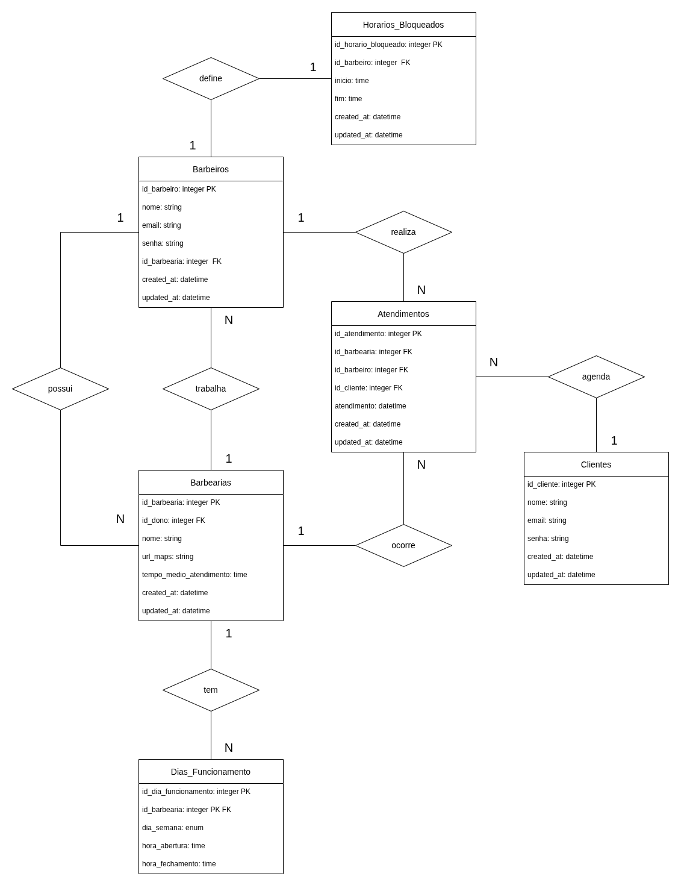

[Voltar](../README.md)

# Documentação
Aqui estão os links para a documentação de cada elemento presente no sistema:

- [Tipo de retorno](./retorno/README.md)
- [Cliente](./cliente/README.md)
- [Barbeiro](./barbeiro/README.md)
- [Barbearia](./barbearia/README.md)
- [Horário Bloqueado](./horario-bloqueado/README.md)
- [Auth](./auth/README.md)
- [Endereço](./endereco/README.md)

## DER

Autor: Giovanne Monteiro de Melo (Gmmbr10)